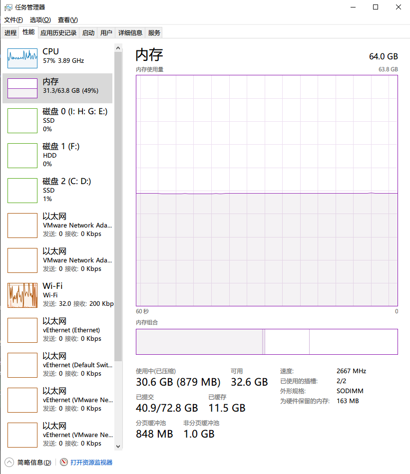
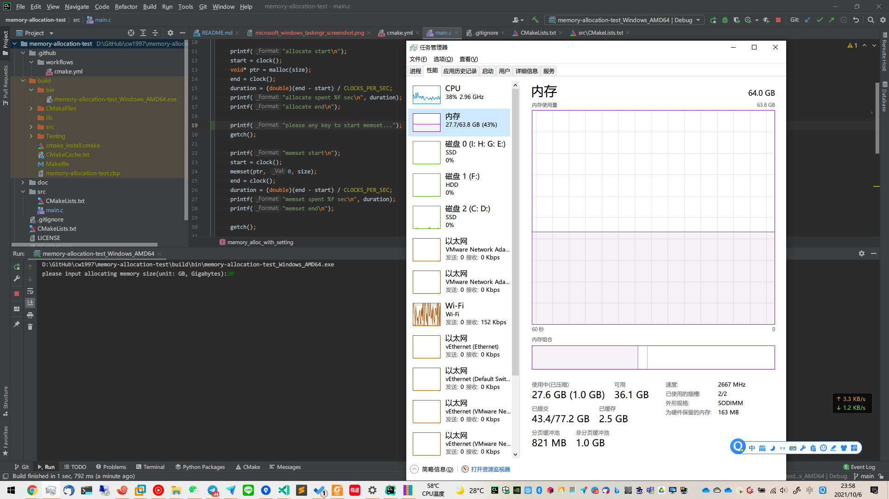
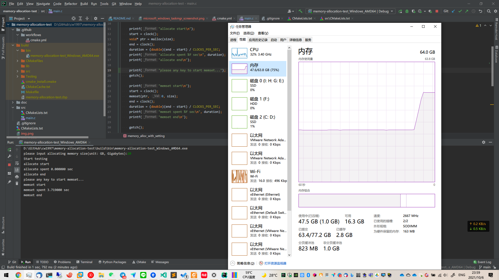
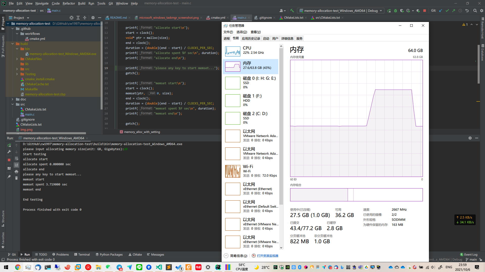

# memory-allocation-test
A memory allocation program, it is used for doing an experiment to find out the detail of Microsoft Windows taskmgr performance information

# Microsoft Windows 任务管理器 【内存】选项卡中各项指标的含义

如图所示，Microsoft Windows 任务管理器 【内存】选项卡中包含如下指标
- 使用中（已压缩）
- 可用
- 已提交
- 已缓存
- 分页缓冲池
- 非分页缓冲池

接下来以上图为例，对这些指标做解释

## 已提交
对应图上的 `40.9/72.8 GB`

该参数有两个部分，从左至右分别对应：**已申请/总虚拟内存**
### 已申请
对应上图的`40.9`部分

其指示当前操作系统上所有进程使用 `malloc()` 等内存分配函数**已经申请**的内存总容量

例如当你启动一个新的进程，并且执行了 `malloc(1024 * 1024)` ，那么此时【已申请】部分则会增加 1 MB

### 总虚拟内存
对应上图的 `72.8 GB`
操作系统的【总虚拟内存】包括【物理内存】和【交换区】

#### 物理内存
【物理内存】为实际安装在电脑主板上的内存条所包含的总容量

如上图所示，我在电脑上安装了两条 32 GB 的内存条，则我的总【物理内存】为 2 * 32 = 64 GB

#### 交换区
当【物理内存】**不够用**时，操作系统会向**硬盘**申请一块存储空间，临时将**部分不被经常使用的内存数据**存储在硬盘上。
等该**部分不被经常使用的内存数据**被需要**读写时**，再重新**将其从硬盘拷贝至物理内存中交换区**

由于位于交换区的数据需要在【物理内存】和【硬盘】上**交换数据**，因此称为【交换区】

但是实际上在 Windows Microsoft 操作系统的 UI 文案中通常将其写为【虚拟内存】，
其概念**并非**通常在 Computer Science 学科中所指的【虚拟内存空间】 ，因此请注意不要混淆

### 使用中
对应上图的`30.6 GB`部分

其指示当前操作系统上所有进程使用 `malloc()` 等内存分配函数**已经申请**，
并且使用**任何能够写入该内存区域的手段**对该内存区域进行**写入之后**的内存总容量

例如当你启动一个新的进程，并且执行了 `void *point = malloc(1024 * 1024)` ，那么此时【已申请】部分则会增加 1 MB，
在这之后执行了 `memset(point, 0, 1024 * 1024)` ，则【使用中】部分将会增加 1 MB

#### 实验
在本 GitHub repo 的 Release 页面中下载对应的测试程序
https://github.com/cw1997/memory-allocation-test/releases

初始内存占用情况如图所示
- 使用中：27.7 GB
- 已提交：63.4 GB

打开后输入需要申请的内存空间
第一次输入 20 后按`回车键`，测试程序将会调用 `malloc()` 函数向操作系统申请 `20 GB` 的内存空间

此时观察 taskmgr 将会发现
【已提交】的左半部分（即【已申请】部分）从 `43.4` 增长至 `63.4` ，增长了 `20 GB` ，
【使用中】几乎无变化，
说明
【已提交】的左半部分（即【已申请】部分）对应已经向操作系统申请内存的空间大小

再次按下`回车键`，测试程序将会调用 `memset()` 函数向刚刚申请的 `20 GB` 的内存空间中写入 `20 GB` 的数据
（数据值为 `memset()` 的**第二个参数**，在本程序中为全 0）

此时观察 taskmgr 将会发现
【使用中】从 `27.7` 增长至 `47.5` ，增长了 `20 GB` ，
【可用】从 `36.1` 增长至 `16.3` ，大约降低了 `20 GB` ，
说明
【使用中】对应已经向操作系统申请并且使用的内存的空间大小，
【可用】对应内存中实际可以继续被其他进程所使用的空间

再次按下`回车键`，程序退出，操作系统回收该程序进程所占用的所有内存空间，该内存空间可被其它进程所使用

此时观察 taskmgr 将会发现
【使用中】从 `47.5` 增长至 `27.5` ，降低了 `20 GB` ，
【已提交】的左半部分（即【已申请】部分）从 `63.4` 增长至 `463.4` ，降低了 `20 GB` ，
【可用】从 `16.3` 增长至 `36.2` ，大约增长了 `20 GB` 

### 已压缩
现代 CPU 性能已经足够高，因此可以充分利用空闲的 CPU 时间对内存中较为不常用的数据进行压缩后存储在内存中，
当这部分数据重新被读写时再将其解压缩

操作系统根据一定策略自动进行该内存压缩操作

### 已缓存
Microsoft Windows 会在读取硬盘数据的同时将该数据存入内存中的可用区域，以便加速下一次访问，
这些被磁盘数据所占用的区域称为【已缓存】

当某个进程需要对【已缓存】区域中的数据对应在硬盘上的文件进行读写时，
Microsoft Windows 会自动同时修改内存缓存区和硬盘上的文件数据，
内存缓存区域内已修改的数据同步在硬盘上修改的过程称为“刷盘”或者“同步”，
这些过程都会被操作系统自动执行以保证数据安全落盘，因此大部分情况下无需担心突然掉电或者宕机等意外事故导致数据丢失的问题

### 非分页缓冲池
操作系统中有一部分对实时性要求极高的关键性数据，例如 CPU 中断处理函数，驱动程序代码等，
这些数据不允许被交换到硬盘（否则会极大影响系统运行速度），
或者当被用作【交换区】的硬盘出现故障时，关键性代码将无法从硬盘交换到物理内存被执行，导致系统宕机
（考虑一种情况：作为【交换区】的磁盘分区**并非安装有操作系统**的磁盘分区，
因此当未把关键性数据交换到硬盘的时候，当作为【交换区】的磁盘分区发生故障并不会导致整个操作系统宕机）

### 分页缓冲池
还记得前面提到的【交换区】吗？这里便是已经被交换到硬盘上的数据

因为物理内存数据交换到交换区的过程中，数据是以“页面”的方式交换出来，页面是操作系统将一块内存数据按照“页尺寸”划分为多个“页面”，
然后将这些“页面”数据交换至硬盘中，这是“分页”一词的含义
